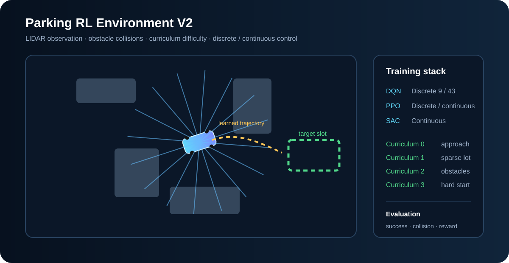

# Autonomous Parking RL Benchmark

A reproducible reinforcement-learning project for autonomous parking with **DQN, PPO and SAC**, multiple action representations, obstacle-aware LIDAR observations and success-driven curriculum learning.



The repository preserves the simpler recovered environment in `parking_env.py` and adds a more demanding V2 environment rather than silently rewriting the historical baseline.

## Project structure

```text
parking_env.py              recovered stable geometric baseline
parking_env_v2.py           obstacles + LIDAR + curriculum + reward decomposition
curriculum.py               success-driven difficulty promotion callback
train.py                    simple DQN/PPO/SAC baseline runner
train_v2.py                 YAML-configured V2 training + four-level evaluation
configs/
  dqn_baseline.yaml         discrete baseline
  stable_ppo.yaml           primary curriculum profile
  experimental_sac.yaml     continuous-control research profile
assets/parking_env.svg      environment / training visual
```

## Algorithm matrix

| Algorithm | Action space | Intended use |
|---|---|---|
| **DQN** | 9 or 43 discrete commands | interpretable discrete baseline |
| **PPO** | discrete or continuous | stable general-purpose benchmark |
| **SAC** | continuous steering/throttle | off-policy continuous-control experiment |

The project does not force algorithms into incompatible action spaces merely to inflate a comparison table.

## Environment V2

The V2 environment adds:

- randomized parking target pose and start pose;
- axis-aligned parked-car/obstacle geometry;
- configurable 360° LIDAR rays;
- collision termination;
- 9-action, 43-action and native continuous control;
- `approach → align → settle` phase features;
- progress, heading-alignment, low-speed settling, smoothness and terminal reward components;
- deterministic seeds;
- four curriculum levels with increasingly difficult initial conditions and obstacle density.

The lightweight kinematics are intentional: this project is about **RL environment/reward/curriculum design and algorithm comparison**, not claiming high-fidelity vehicle dynamics.

## Curriculum

`SuccessCurriculumCallback` watches terminal episode outcomes and promotes difficulty only when a rolling success window exceeds a configured threshold.

```text
Level 0  open approach task
   ↓ sustained success
Level 1  sparse parking lot
   ↓
Level 2  denser obstacle field
   ↓
Level 3  long/hard initial poses
```

Promotion is data-driven rather than tied to an arbitrary fixed training timestep.

## Train

Install:

```bash
python -m venv .venv
source .venv/bin/activate          # Windows: .venv\Scripts\activate
pip install -r requirements.txt
```

Primary profile:

```bash
python train_v2.py --config configs/stable_ppo.yaml
```

Other profiles:

```bash
python train_v2.py --config configs/dqn_baseline.yaml
python train_v2.py --config configs/experimental_sac.yaml
```

Each V2 run saves:

```text
artifacts/v2/<run>/model.zip
artifacts/v2/<run>/config.json
artifacts/v2/<run>/evaluation.json
```

## Evaluation protocol

A trained model is evaluated on **all four curriculum levels with disjoint deterministic seeds**. The evaluation output includes:

- parking success rate;
- collision rate;
- mean episodic return;
- mean episode length;
- mean final distance to the target.

A proper comparison should repeat training across multiple seeds and report aggregate distributions rather than one lucky learning curve.

## Stable vs experimental profiles

### `configs/stable_ppo.yaml`

The portfolio-facing default. It uses a 9-action policy, PPO and conservative success-driven curriculum thresholds.

### `configs/dqn_baseline.yaml`

A simple discrete baseline useful for testing whether more complex policy optimization is actually necessary.

### `configs/experimental_sac.yaml`

Continuous-control SAC with a larger replay buffer and stricter curriculum promotion. This profile is intentionally labeled experimental; its presence does not imply superior benchmark results before those results are measured.

## Reward design

The environment returns a reward decomposition in `info['reward_terms']`. This makes shaping behavior auditable and supports ablation studies instead of treating reward as a mysterious scalar.

```text
reward = progress
       + near-target heading alignment
       + low-speed settling
       - steering discontinuity
       - time penalty
       + success/collision terminal term
```

## CI

GitHub Actions runs Ruff, environment/collision/LIDAR tests and builds each algorithm configuration without spending CI minutes on full RL training.

## Provenance

This is a personal parking-RL project reconstructed and reorganized from earlier personal development work. The repository uses synthetic geometry and contains no employer code, data or scenarios.
